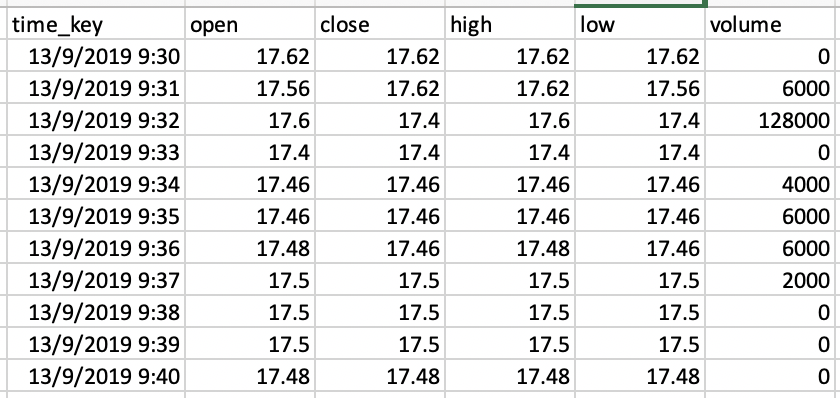

# QTrader: A Light Event-Driven Backtesting Framework

QTrader is a light and flexible event-driven framework that can be used to backtest different algorithmic strategies.

## Quick install

You may run the folllowing command to install QTrader immediately:

```python
# python 3.7 or above is supported
>> conda create -n qtrader python=3.7
>> conda activate qtrader
>> pip install git+https://github.com/josephchenhk/qtrader@master
```

## Get the data ready

QTrader supports 1 minute bar data at the moment. What you need to prepare is CSV files with file names in the format of 
"[symbol]-yyyy-mm-dd.csv"



And you should specify the path of data folder in `qtrader.config.config.py`. For example, set

```python
DATA_PATH = "./qtrader/data" 
```

and put all your CSV files to the following folder:

```python
{DATA_PATH}/k_line/K_1M
```

## How to implement a strategy

To implement a strategy is simple in QTrader. A strategy needs to implement `init_strategy` and `on_bar` methods in 
`BaseStrategy`. Here is a quick sample:

```python
from qtrader.core.strategy import BaseStrategy

class MyStrategy(BaseStrategy):

    def init_strategy(self):
        pass
        
    def on_bar(self, cur_data:Dict[Stock, Bar]):
        print(cur_data)
```

        
## How to record anything I want

QTrader provides a module named `BacktestRecorder` to record variables during backtesting. By default, it saves `datetime` 
and `portfolio_value` every timestep. 

If you want to record additional variables, you need to write a method called `get_var` in your strategy:

```python
from qtrader.core.strategy import BaseStrategy

class MyStrategy(BaseStrategy):

    def get_var(self):
        return XXX
```

And initialize your `BacktestRecorder` with the same vairable `var=[]`:

```python
recorder = BacktestRecorder(var=[])
```
    
## Run a backtest

Here we go! Here is a sample of running a backtest in QTrader:

```python
# prepare stock list
stock_list = [
    Stock(code="HK.00700", lot_size=100, stock_name="腾讯控股"),
    Stock(code="HK.09988", lot_size=100, stock_name="阿里巴巴-SW"),
]

# A BacktestGateway is a market simulator
market = BacktestGateway(
    securities=stock_list,
    start=datetime(2021, 1, 25, 9, 30, 0, 0),
    end=datetime(2021, 2, 1, 12, 0, 0, 0),
)
# position management
position = Position()
# account balance management
account_balance = AccountBalance()
# portfolio management
portfolio = Portfolio(account_balance=account_balance,
                        position=position,
                        market=market)
# execution engine
engine = Engine(portfolio)

# initialize a strategy
strategy = MyStrategy(stock_list, engine=engine)
strategy.init_strategy()

# initialize a backtest
recorder = BacktestRecorder()
backtest = Backtest(strategy, recorder)

# run a backtest
backtest.run()

# plot pnl curve of the backtest
plot_pnl(backtest.recorder.datetime, backtest.recorder.portfolio_value)
```


