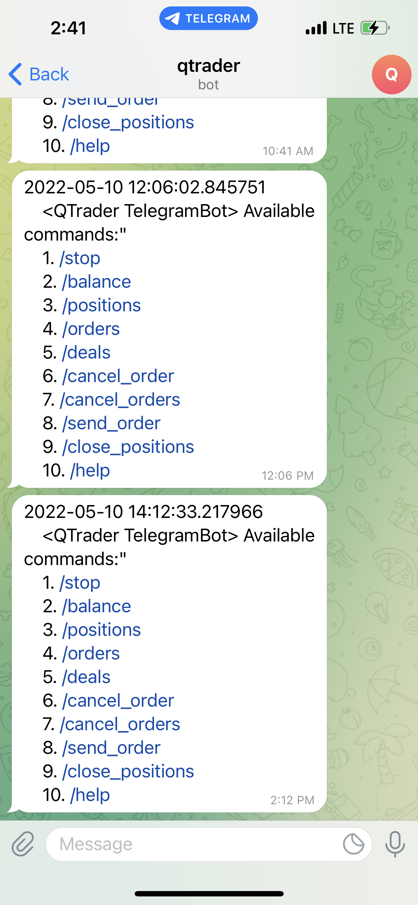

# QTrader: A Light Event-Driven Algorithmic Trading Engine

<p align="center">
    
    
    
    
    
</p>

**Latest update on 2022-08-08**

QTrader is a light and flexible event-driven algorithmic trading engine that 
can be used to backtest strategies, and seamlessly switch to live trading 
without any pain.

## Key Features

* Completely **same code** for backtesting / simulation / live trading 

* Support trading of various assets: equity, futures

* Resourceful functionalities to support live monitoring and analysis

## Quick Install

You may run the folllowing command to install QTrader immediately:

```python
# Virtual environment is recommended (python 3.8 or above is supported)
>> conda create -n qtrader python=3.8
>> conda activate qtrader

# Install stable version from pip (currently version 0.0.4)
>> pip install qtrader

# Alternatively, install latest version from github 
>> pip install git+https://github.com/josephchenhk/qtrader@master
```

## Prepare the Data

QTrader supports bar data at the moment. What you need to do is creating a 
folder with the name of the security you are interested in. Let's say you want 
to backtest or trade HK equity **"HK.01157"** in frequency of **1 minute**, your 
data folder should be like this (where "K_1M" stands for 1 minute; you can also 
find a sample from the qtrader/examples/data):


And you can prepare OHLCV data in CSV format, with dates as their file names, 
e.g., **"yyyy-mm-dd.csv"**: 


Inside each csv file, the data columns should look like this:


Now you can specify the path of data folder in `qtrader/config/config.py`. For 
example, set

```python
DATA_PATH = {
    "kline": "path_to_your_qtrader_folder/examples/data/k_line",
}
```

## Implement a Strategy

To implement a strategy is simple in QTrader. A strategy needs to implement 
`init_strategy` and `on_bar` methods in `BaseStrategy`. Here is a quick sample:

```python
from qtrader.core.strategy import BaseStrategy

class MyStrategy(BaseStrategy):

    def init_strategy(self):
        pass
        
    def on_bar(self, cur_data:Dict[str, Dict[Security, Bar]]):
        print(cur_data)
```

        
## Record Variables

QTrader provides a module named `BarEventEngineRecorder` to record variables 
during backtesting and/or trading. By default it saves `datetime`, 
`portfolio_value` and `action` at every time step. 

If you want to record additional variables (let's say it is called `var`), you 
need to write a method called `get_var` in your strategy:

```python
from qtrader.core.strategy import BaseStrategy

class MyStrategy(BaseStrategy):

    def get_var(self):
        return var
```

And initialize your `BarEventEngineRecorder` with the same vairable `var=[]`(if 
you want to record every timestep) or `var=None`(if you want to record only the 
last updated value):

```python
recorder = BarEventEngineRecorder(var=[])
```
    

## Run a Backtest

Now we are ready to run a backtest. Here is a sample of running a backtest in 
QTrader:

```python
# Security 
stock_list = [
    Stock(code="HK.01157", lot_size=100, security_name="中联重科", exchange=Exchange.SEHK),
]

# Gateway
gateway_name = "Backtest"
gateway = BacktestGateway(
    securities=stock_list,
    start=datetime(2021, 3, 15, 9, 30, 0, 0),
    end=datetime(2021, 3, 17, 16, 0, 0, 0),
    gateway_name=gateway_name,
)
gateway.SHORT_INTEREST_RATE = 0.0
gateway.set_trade_mode(TradeMode.BACKTEST)

# Core engine
engine = Engine(gateways={gateway_name: gateway})

# Strategy initialization
init_capital = 100000
strategy_account = "DemoStrategy"
strategy_version = "1.0"
strategy = DemoStrategy(
    securities={gateway_name: stock_list},
    strategy_account=strategy_account,
    strategy_version=strategy_version,
    init_strategy_cash={gateway_name: init_capital},
    engine=engine,
    strategy_trading_sessions={
        "HK.01157": [
            [datetime(1970, 1, 1, 9, 30, 0), datetime(1970, 1, 1, 12, 0, 0)],
            [datetime(1970, 1, 1, 13, 0, 0), datetime(1970, 1, 1, 16, 0, 0)],
        ],
)
strategy.init_strategy()

# Recorder
recorder = BarEventEngineRecorder()

# Event engine
event_engine = BarEventEngine(
    {"demo": strategy},
    {"demo": recorder},
    engine
)

# Start event engine
event_engine.run()

# Program terminates normally
engine.log.info("Program shutdown normally.")
```

After shutdown, you will be able to find the results in qtrader/results, with 
the folder name of latest time stamp:


The result.csv file saves everything you want to record in 
`BarEventEngineRecorder`; while pnl.html is an interactive plot of the equity 
curve of your running strategy:


## Simulation / Live trading

Ok, your strategy looks good now. How can you put it to paper trading and/or 
live trading? In QTrader it is extremely easy to switch from backtest mode to 
simulation or live trading mode. What you need to modify is just 
**two** lines (replace a backtest gateway with a live trading gateway!):

```python
# Currently you can use "Futu", "Ib", and "Cqg" 
gateway_name = "Futu"  

# Use FutuGateway, IbGateway, or CqgGateway accordingly
# End time should be set to a future time stamp when you expect the program terminates
gateway = FutuGateway(
    securities=stock_list,
    end=datetime(2022, 12, 31, 16, 0, 0, 0),  
    gateway_name=gateway_name,
)

# Choose either TradeMode.SIMULATE or TradeMode.LIVETRADE
gateway.set_trade_mode(TradeMode.LIVETRADE)
```

That's it! You switch from backtest to simulation / live trading mode now. 

**Important Notice**: In the demo sample, the live trading mode will keep on
sending orders, please be aware of the risk when running it.

## Live Monitoring

When running the strategies, the trader typically needs to monitor the market 
and see whether the signals are triggered as expected. QTrader provides with
such **dashboard**(visualization panel) which can dynamically update the market data and gives
out entry and exit signals in line with the strategies. 

You can activate this function in your `config.py`:

```python
ACTIVATED_PLUGINS = [.., "monitor"]
```

After running the main script, you
will be able to open a web-based monitor in the browser: `127.0.0.1:8050`:


QTrader is also equipped with a **Telegram Bot**, which allows you get instant
information from your trading program. To enable this function, you can add your
telegram information in `qtrader.config.config.py`(you can refer to the
following [link](https://core.telegram.org/bots/api) for detailed guidance):

```python
ACTIVATED_PLUGINS = [.., "telegram"]

TELEGRAM_TOKEN = "50XXXXXX16:AAGan6nFgmrSOx9vJipwmXXXXXXXXXXXM3E"
TELEGRAM_CHAT_ID = 21XXXXXX49
```

In this way, your mobile phone with telegram will automatically receive a
documenting message：



You can use your mobile phone to monitor and control your strategy now.

## Contributing
* Fork it (https://github.com/josephchenhk/qtrader/fork)
* Study how it's implemented.
* Create your feature branch (git checkout -b my-new-feature).
* Use [flake8](https://pypi.org/project/flake8/) to ensure your code format
complies with PEP8.
* Commit your changes (git commit -am 'Add some feature').
* Push to the branch (git push origin my-new-feature).
* Create a new Pull Request.

